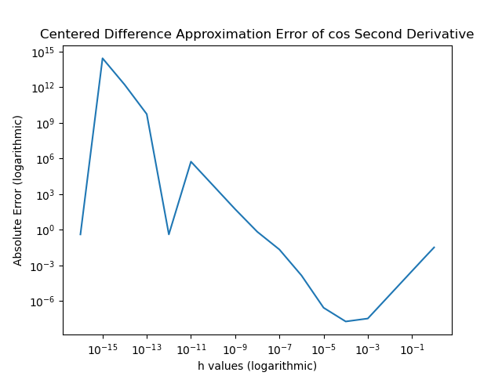

# Task Sheet Two Solutions

### Task 1

For the progam for task 1 see the file HelloWorld.py. Code is below:

```

print("Hello World")

```


### Task2

The link for the table of contents is in the readme and the software manual as well.

### Task3

The table of contents is this document and I have done git pulls successfully.

### Task 4

For the analysis of task 4 and task 5 see the pdf [Error Analysis](Error_Analysis.pdf).

### Task 5
For the program for task 5 see the file [derivative approximation](derivative_approximation.py). The code is found below


| h        | Error Magnitude |
|---------|------------------------------|
| h=1,      | Error=0.03354335418516324 |
| h=0.5,    | Error=0.00859779968692631 |
| h=0.1,    | Error=0.00034667345475336564 |
| h=0.01,   | Error=3.467876013296678e-06 |
| h=0.001,  | Error=3.4640095514237856e-08 |
| h=0.0001, | Error=1.9541062379335727e-08 |
| h=1e-05,  | Error=2.802191542139454e-07 |
| h=1e-06,  | Error=0.0001462692200962512 |
| h=1e-07,  | Error=0.022391258179794482 |
| h=1e-08,  | Error=0.694076188078014 |
| h=1e-09,  | Error=55.09500439471068 |
| h=1e-10,  | Error=5550.698976289234 |
| h=1e-11,  | Error=555111.0961657417 |
| h=1e-12,  | Error=0.4161468365471424 |
| h=1e-13,  | Error=5551115122.709635 |
| h=1e-14,  | Error=1665334536938.1511 |
| h=1e-15,  | Error=277555756156288.72 |
| h=1e-16,  | Error=0.4161468365471424 |

Here it a graph of the above table.



### Task6
One interesting thing that I learned was that for forward backward and central difference approximations there are general froms for the nth order derivative. These involved binomial coefficents and mulitples of h to approximate an nth order derivative. I also read about how they use the same technique to approximate partial differencial equations, but it seems that they use some initial function to get the started on the approximation. Below is one example of a third order finite difference approximation I found in my search.

f'''(x)=(1/6h)(2f(x+h)+3f(x)-6f(x-h)+u(x-2h)

Sources

[https://en.wikipedia.org/wiki/Finite_difference](https://en.wikipedia.org/wiki/Finite_difference)

[http://web.mit.edu/16.90/BackUp/www/pdfs/Chapter12.pdf](http://web.mit.edu/16.90/BackUp/www/pdfs/Chapter12.pdf)

[https://archive.siam.org/books/ot98/OT98Chapter1.pdf](https://archive.siam.org/books/ot98/OT98Chapter1.pdf)
