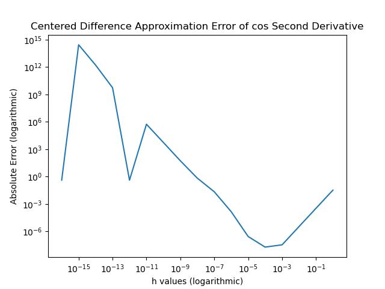

# Solutions For Task Sheet 3

### Tasks 1 and 2

For the program for tasks 1 and 2 see the file [derivative approximation](../sheet2/derivative_approximation.py). Below is the table of error magnitudes. The loglog plot was created by matplotlib's loglog function, and therfore printing log differences was not needed.

| h        | Error Magnitude |
|---------|------------------------------|
| h=1,      | Error=0.03354335418516324 |
| h=0.5,    | Error=0.00859779968692631 |
| h=0.1,    | Error=0.00034667345475336564 |
| h=0.01,   | Error=3.467876013296678e-06 |
| h=0.001,  | Error=3.4640095514237856e-08 |
| h=0.0001, | Error=1.9541062379335727e-08 |
| h=1e-05,  | Error=2.802191542139454e-07 |
| h=1e-06,  | Error=0.0001462692200962512 |
| h=1e-07,  | Error=0.022391258179794482 |
| h=1e-08,  | Error=0.694076188078014 |
| h=1e-09,  | Error=55.09500439471068 |
| h=1e-10,  | Error=5550.698976289234 |
| h=1e-11,  | Error=555111.0961657417 |
| h=1e-12,  | Error=0.4161468365471424 |
| h=1e-13,  | Error=5551115122.709635 |
| h=1e-14,  | Error=1665334536938.1511 |
| h=1e-15,  | Error=277555756156288.72 |
| h=1e-16,  | Error=0.4161468365471424 |

Here it a loglog graph of the above table.



The way that can be computationally verified that this is second order acurate is seen in the graph. In stable portion of the graph there the slope of the line loops to be about -2, which is what we would expect for something second order acurate. The code begins to fail at about h = .0001 due to  finite precision in the number representation and/or finite precision of arithmetic.

### Task 3
The code is found in the files [SinglePoint.java](src/SinglePoint.java) and [DoublePoint.java](src/DoublePoint.java)
Here is the comparision. The output for the single point is 

```
The number of binary digits that can be obtained for single point is 24.0
The smallest number this corresponds to is 5.9604644775390625E-8

```
And for the double point we get

```
The number of binary digits that can be obtained for double point is 53.0
The smallest number this corresponds to is 1.1102230246251565E-16

```
### Task 5
My python source code is in a folder called lib in the root directory of this repository.

### Task 6
One advantage of creating a shared library is that it saves memory. It allows you to save space on your computer by only needing one copy of each routine. Another advantage is that they can make complex code easier to read by compartmentalizing certain functions. A disadvantage is that they make version control harder. When the library updates if it is not backwards compatible then it might cause the code to crash when it updates.

Here are links for sites.
(https://docs.oracle.com/cd/E19205-01/819-5267/bkamn/index.html)[https://docs.oracle.com/cd/E19205-01/819-5267/bkamn/index.html]
(https://stackoverflow.com/questions/1082047/pros-and-cons-of-using-shared-library-vs-fully-encapsulated-ear)[https://stackoverflow.com/questions/1082047/pros-and-cons-of-using-shared-library-vs-fully-encapsulated-ear]

